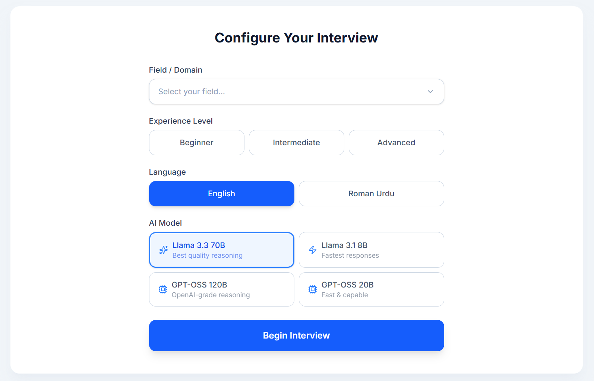
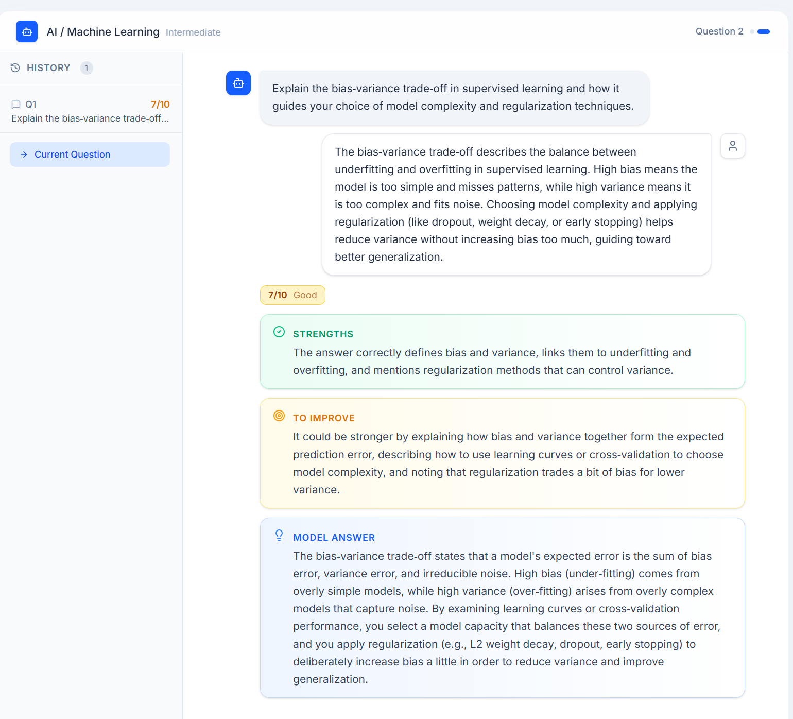
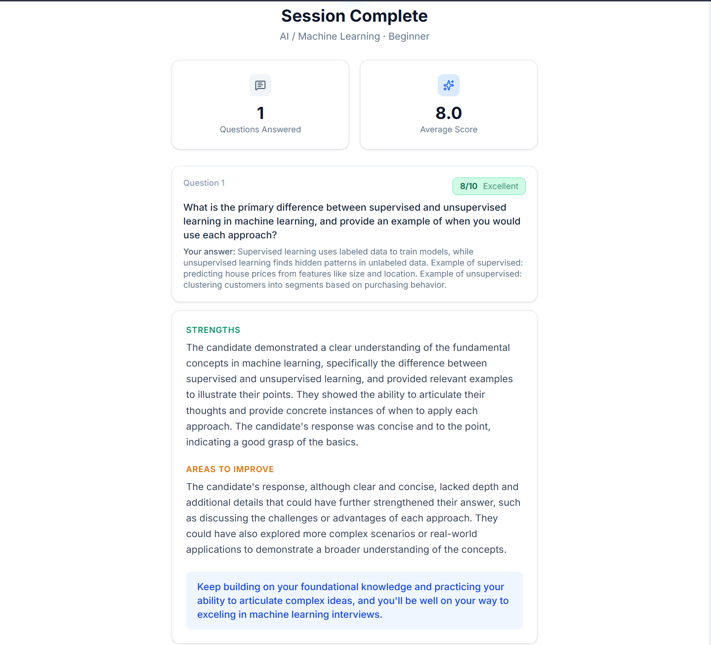
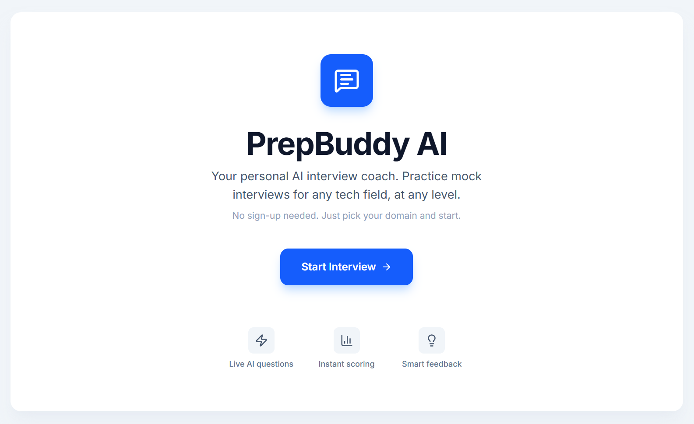

# PrepBuddy AI — Mock Interview Coach

**PrepBuddy AI** is a live, AI-powered mock interview practice app built for CS, AI, and engineering students. It generates unique interview questions on the fly, evaluates your spoken or typed answers, and gives you structured, honest feedback — no static question bank, no login, no database.

### The Problem

In Pakistan (and across much of the developing world), students spend years memorizing theory but have almost no access to realistic mock interview practice. There is no coach, no feedback loop, and no safe space to practice before a real interview. PrepBuddy solves this by giving every student a **personal AI interviewer** that is available 24/7, across any technical domain and experience level, in English **or** Roman Urdu.

### Live URL

**[https://prepbuddy-ai.vercel.app](https://prepbuddy-ai.vercel.app)**

---

## Features

- **Domain & level selection** — Choose from AI/ML, Web Dev, Data Science, Networking, Cybersecurity, DevOps, General CS, or type a custom domain. Pick Beginner, Intermediate, or Advanced.
- **Bilingual interviews** — Practice in English or Roman Urdu (Urdu written in English script).
- **AI-generated questions** — Every question is generated live by the LLM. No two sessions are the same. Previous questions are tracked so the model avoids repetition.
- **Real-time answer evaluation** — Submit your answer and get an instant score (1–10), strengths, improvement areas, and a model answer — all in structured feedback cards.
- **Voice input** — Speak your answers using the built-in microphone button (Speech-to-Text via Whisper on Groq).
- **Unlimited questions** — Continue as long as you want. Each question is independent.
- **Session summary** — End the session anytime to receive a full AI-generated review: average score, overall strengths, recurring weaknesses, and encouragement.
- **One-question-at-a-time UI** — Focus on one question at a time. A history sidebar lets you review all past questions, answers, and scores with a single click.
- **No sign-up, no database** — Everything runs in your browser session. Start practicing in seconds.

---

## The AI Feature

All interview intelligence is powered by **three custom system prompts** sent to the Groq API running the `llama-3.3-70b-versatile` model (with fallback options for other Groq-hosted models). There is zero hardcoded content — every question, evaluation, and summary is generated uniquely by the LLM.

### 1. Question Generator

**What it does:** Given the candidate's domain, experience level, and language preference, the LLM generates a single realistic interview question. Previously asked questions are passed along so the model avoids repeating themes.

**System prompt:**

```
You are an experienced technical interviewer conducting a mock interview
for a candidate applying in the field of {domain}, at {level} experience
level.

Ask the question in {English|Roman Urdu}.

Ask exactly ONE realistic interview question that a real employer would ask
in this field and level. It should be clear, specific, and answerable in a
few sentences to a short paragraph. Do not ask multiple questions. Do not
include any preamble, numbering, or explanation -- return ONLY the question
text itself.

Avoid repeating question themes already covered in this session:
{previous questions list}
```

### 2. Answer Evaluator

**What it does:** Given the question, the candidate's answer, and the language preference, the LLM returns a structured JSON evaluation with a score (1–10), what was good, what to improve, and a model answer.

**System prompt:**

```
You are a friendly but honest interview coach. Respond in {language}.

Evaluate the answer and return a JSON object with EXACTLY these fields:
{
  "score": <integer 1-10>,
  "good": "<1-2 sentences on what was good about the answer>",
  "improve": "<1-2 sentences on what was missing or could be improved>",
  "modelAnswer": "<a short 2-4 sentence example of a strong answer>"
}

Return ONLY valid JSON, no markdown code fences, no extra text.
```

### 3. Session Summarizer

**What it does:** When the user ends the session, the LLM reviews the full transcript of all questions, answers, and scores, and returns an overall summary.

**System prompt:**

```
You are an interview coach reviewing a full mock interview session.
Domain: {domain}, Level: {level}.

Respond in {language}. Return a JSON object with:
{
  "averageScore": <number>,
  "strengths": "<2-3 sentence summary of what the candidate did well overall>",
  "weaknesses": "<2-3 sentence summary of recurring gaps>",
  "encouragement": "<one warm, motivating closing line>"
}

Return ONLY valid JSON, no markdown code fences.
```

---

## Tools, Services & AI Models

| Tool / Service | Purpose |
|---|---|
| [Next.js 16](https://nextjs.org/) (App Router) | Full-stack web framework |
| [TypeScript](https://www.typescriptlang.org/) | Type safety and developer experience |
| [Tailwind CSS v4](https://tailwindcss.com/) | Utility-first styling |
| [lucide-react](https://lucide.dev/) | Icon library |
| [Groq API](https://groq.com/) | AI inference for LLM + STT |
| [Llama 3.3 70B Versatile](https://groq.com/) | Primary LLM for question generation, evaluation & summarization |
| [Whisper (via Groq)](https://groq.com/) | Speech-to-text for voice answers |
| [Vercel](https://vercel.com/) | Deployment and hosting |
| [GitHub](https://github.com/) | Source control and public repository |

---

## Screenshots

### Setup Screen


### Interview Screen


### Feedback Cards


### Welcome / Landing


---

## How to Run Locally

1. **Clone the repository**

   ```bash
   git clone https://github.com/aamirr-shah/prepbuddy-ai.git
   cd prepbuddy-ai
   ```

2. **Install dependencies**

   ```bash
   npm install
   ```

3. **Set up environment variables**

   Create a `.env.local` file in the project root:

   ```env
   GROQ_API_KEY=your_groq_api_key_here
   ```

   Get a free API key at [console.groq.com](https://console.groq.com).

4. **Start the development server**

   ```bash
   npm run dev
   ```

5. **Open the app**

   Visit [http://localhost:3000](http://localhost:3000) in your browser.

---

*Built for the AI App Development final project — Summer 2026.*
